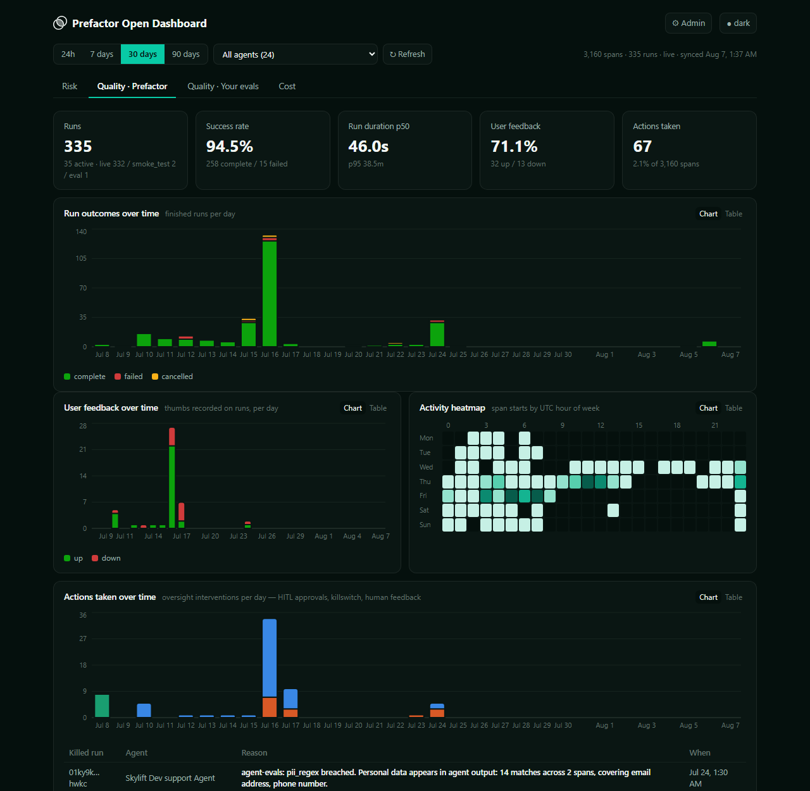

# Prefactor Open Dashboard

A local, open-source dashboard for your [Prefactor](https://prefactor.tech) agent telemetry — risk, quality, and cost across every agent in your account, computed from your own raw spans. Runs on your machine, updates live, and your API token never leaves it.



## Quick start

You need [Node.js 18.17 or newer](https://nodejs.org) (`node --version` to check). Nothing else — no database, no Docker, no account beyond the Prefactor one you already have.

```bash
git clone https://github.com/prefactordev/prefactor-open-dashboard.git
cd prefactor-open-dashboard
npm install
npm start
```

Then open **http://localhost:8788**. The dashboard opens an **Admin** panel asking for your Prefactor API token — paste it, click *Save & connect*, and data starts filling in within seconds.

That's it. `npm start` builds the app the first time and serves it; later starts skip the build.

> No git? Download the repository as a ZIP, unzip it, then run `npm install && npm start` in the folder.

### Getting your API token

In the Prefactor app: **Account → API Tokens**. Create an admin/session token — a long `eyJ…` JWT.

This is *not* the `pf_…` SDK ingestion key your agents use to send data; that one can't read it back. If you paste the wrong one, the Admin panel validates it against the API and tells you immediately rather than failing silently later.

The token is stored only by the local server (in `DATA_DIR/config.json`, mirrored to `.env` when writable) and is **write-only from the browser's side**: no endpoint ever returns it, so screen-sharing the dashboard can't leak it. The server also binds to `127.0.0.1`, so nothing on your network can reach it.

To point the dashboard at a different Prefactor account, open **⚙ Admin** and paste that account's token — the cache resets and re-syncs automatically.

## What you're looking at

Four tabs, all scoped by the shared time-range and agent filters at the top, so every number on screen agrees.

| Tab | What it shows | Where it comes from |
|---|---|---|
| **Risk** | Risk-scored spans over time, risk by span type, score distribution, riskiest spans, sensitive-data exposure, open alerts | Prefactor scores risk *on read* for agents that have a risk profile assigned |
| **Quality · Prefactor** | Run outcomes and success rate, duration percentiles, per-span-type timings, user thumbs feedback, activity mix and heatmap, rendered quality summaries | Signals the platform computes or renders itself |
| **Quality · Your evals** | Score coverage, auto-discovered score fields with daily trends, recent scored runs | `quality_payload` — the JSON *your* instrumentation or eval tooling attaches to runs |
| **Cost** | Estimated spend, tokens in/out, cost by model over time, model economics, latency, finish reasons, top runs by cost | Token usage on LLM spans × the per-model price table in `src/lib/cost.ts` |

The quality split is by **who created the signal**: Prefactor renders `quality_summary` and captures thumbs feedback; `quality_payload` is always written by your own code. Every tab that finds no data explains exactly how to light it up rather than showing an empty chart.

## Actions taken — what counts, and how to make each show up

The Risk and Quality tabs share an **Actions taken** tile (actions ÷ total spans) and an **Actions taken over time** chart. An *action* is an intervention on a run — a human or system stepping in — not the agent's own activity, and not bookkeeping about it. Three kinds are counted, each from a specific signal:

### 1. Killswitch (terminated runs)

Kill an **active** run from any external tool with your admin token:

```
POST /api/v1/agent_instance/{instance_id}/terminate
{ "reason": "policy breach: attempted refund over limit" }
```

`reason` is required and is what the dashboard displays. Detection: any instance in the window whose `termination_reason` is set. Each kill also appears in a "Killed run / Agent / Reason / When" table under the chart.

### 2. Human feedback (a rating)

Record a span carrying a rating when a user rates a run:

```
payload.inputs.feedback.rating: "up" | "down"    <- what Prefactor's thumbs UI writes
payload.inputs.rating:          "up" | "down"    <- also read, for your own spans
```

**Detection is by the presence of a rating, never by schema name.** That matters: `prefactor:quality` carries thumbs in some accounts and is a `{report, result}` eval record in others, so matching on the name would book eval records as human actions. Any non-empty rating counts, so a 1-5 scale works too — those show as "other ratings" beside the up/down split.

### 3. HITL approvals

Instrument your approval flow (e.g. Prefactor's Slack approve/deny) as its own span, and give it a schema name with a whole **segment** of `hitl`, `approval`, or `approvals` — for example `hitl:human-approval`, which is what Prefactor's shipped flow already emits, so it works with no extra effort.

Segments, not substrings: `ai-sdk:tool:approve_refund` is deliberately excluded, as is any schema with a `tool` segment. That is the agent asking for a human, not a human intervening.


**Not counted as actions:** quality-evaluation records. They carry no rating and no approval segment, so neither detector fires — eval scores belong on the *Quality · Your evals* tab, not here.

## Configuration

Everything is optional except the token, and the token is easiest to set from the Admin panel. To use a file instead, copy `.env.example` to `.env`:

| Variable | Default | What it does |
|---|---|---|
| `PREFACTOR_API_TOKEN` | — | Your admin API token (or set it in the Admin panel) |
| `PREFACTOR_API_HOST` | `https://app.prefactorai.com` | Platform API host |
| `PORT` | `8788` | Port to serve on |
| `DATA_DIR` | `./data` | Where the cache and saved token live — point this at a persistent volume when hosting |
| `SYNC_INTERVAL_MS` | `15000` | Poll cadence — the ceiling on how "live" the dashboard is |
| `BACKFILL_HORIZON_DAYS` | `90` | How far back history is fetched — and kept: rows older than this are evicted, which is what bounds memory |
| `MAX_CACHE_SPANS_PER_AGENT` | `60000` | Stops backfill early on very large agents |
| `BIND_HOST` | `127.0.0.1` | Interface to bind. Anything but loopback requires `DASHBOARD_PASSWORD` |
| `DASHBOARD_PASSWORD` | — | Require a password (HTTP Basic) to open the dashboard |
| `ALLOWED_HOSTS` | — | Comma-separated hostnames to accept when hosted (e.g. `dash.example.com`). localhost is always allowed |

### Your token is remembered

Paste a token once and it stays. It's saved to `DATA_DIR/config.json` (and mirrored into `.env` when that's writable), so restarts pick it up with no prompt. If the server can't write anywhere, the Admin panel says so instead of quietly forgetting it.

`PREFACTOR_API_TOKEN` in the real environment always wins over a token saved from the UI — that's what makes hosted config predictable.

### Shareable views

The current view lives in the URL, so you can bookmark or paste it: `?tab=risk|quality-prefactor|quality-external|cost`, `?range=24h|7d|30d|90d`, `?theme=light|dark|auto`, and `?admin` to open the Admin panel.

## Hosting it for a team

It runs the same anywhere Node runs. Two things change when it isn't on your laptop:

**1. Give it a persistent disk.** Point `DATA_DIR` at a mounted volume. The cache and the saved token live there, so redeploys don't re-download your history:

```bash
DATA_DIR=/data BIND_HOST=0.0.0.0 DASHBOARD_PASSWORD=… PREFACTOR_API_TOKEN=… npm start
```

(That inline syntax is POSIX. On Windows use `$env:DATA_DIR="D:\data"; npm start` in PowerShell, or a `.env` file — the server reads one either way.)

Without a persistent `DATA_DIR`, every restart re-backfills from scratch — correct, but slow and rude to the API.

**2. Put a password on it.** This dashboard holds an API token and shows everything your agents did. It binds to `127.0.0.1` by default for that reason. Setting `BIND_HOST` to anything else **requires** `DASHBOARD_PASSWORD` — the server refuses to start otherwise rather than quietly publishing your telemetry. Terminate TLS in front of it (any reverse proxy or platform router); HTTP Basic is only safe over HTTPS.

The sync is a single background worker, so run **one** instance. Several instances against one account multiply upstream load for no benefit.

Price table: edit `PRICES` in `src/lib/cost.ts` to match the models you run. A model with no entry contributes $0 to cost and is flagged in the UI rather than silently ignored.

## Troubleshooting

**"Port 8788 is already in use"** — another copy is probably running; open http://localhost:8788. Otherwise start on another port: `PORT=8790 npm start` (PowerShell: `$env:PORT=8790; npm start` · cmd: `set PORT=8790 && npm start`).

**The Admin panel rejects my token** — you likely pasted the SDK ingestion key (`pf_…`) instead of an admin/session token (`eyJ…`). See *Getting your API token* above.

**Charts are empty but the token works** — check the time range (default is 7 days) and the agent filter. Each tab's empty state names the exact signal it needs; a brand-new account with no agent runs will legitimately show nothing.

**The Risk tab says spans aren't scored** — Prefactor computes risk only for agents with a risk profile assigned. The tab shows which agents are missing one and the API call to fix it.

**It says "fetching history…"** — normal on first run: the dashboard is walking your history in the background while showing you everything it has so far. It finishes on its own and never repeats (the cache persists in `data/`).

**I want to start over** — stop the server, delete the `data/` folder (or whatever `DATA_DIR` points at), start again. Your saved token lives there too, so you'll be asked for it again.

**It says "reconnecting…"** — the live event stream dropped (usually the server restarted). It retries automatically with backoff and catches up on what it missed; the header goes back to "live" on its own.

**"This range is too large to serialise"** — an enormous window exceeded what can be sent in one response. Pick a shorter range or a single agent, or lower `BACKFILL_HORIZON_DAYS` / `MAX_CACHE_SPANS_PER_AGENT`.

**A whole view shows "This view hit an unexpected error"** — one tab failed to render; the rest of the dashboard still works, and it clears itself on the next sync. Please open an issue with the message shown.

**It re-downloaded everything after I pulled an update** — expected when a release changes the shape of the cached data. The cache carries a version; a mismatch is refetched rather than read as if it had the new fields.

## How it works

The platform API serves raw spans at 100 per page with no server-side aggregation, so a naive dashboard re-downloads everything on every page load and takes minutes. This one keeps a local cache instead:

```
browser (React + Recharts, aggregation in the page, instant loads)
   │  GET /api/data (cached snapshot, gzipped)  ·  /api/events (SSE)
server.mjs + server/sync.mjs (zero dependencies)
   │  background sync: incremental, newest-first, politely concurrent
Prefactor Platform API
```

- **Background sync** pages each agent newest-first. After the initial backfill a poll costs two pages per active agent (spans + runs) plus up to 30 quality-detail reads — it stops at the first span it has already seen. Idle agents back off to a ~2-minute cadence.
- **Projection**: only the fields the dashboard reads are cached (~200 bytes per span, not ~3.5KB) — raw *span* payloads never touch disk. Instance `quality_payload`/`quality_summary` are cached in full, since that's the data the evals tab exists to show; the cache file is written mode 0600.
- **Live**: the browser holds an SSE connection; when a sync round lands new data, every chart refreshes. No polling from the browser, no manual reload.

What you should see, measured against an account with an ~80k-spans/week agent:

| Moment | Expected |
|---|---|
| Page load, tab switch, range change | **~1–2s**, from the local cache |
| A new span reaching the screen | **~15–20s** for an active agent (one sync interval, pushed over SSE); up to ~2 min for an agent that has been idle, which polls less often |
| First-ever backfill | Bounded by the API (~2s per 100-span page). Runs in the background; partial data shows immediately and the covered window visibly extends |
| Server restart | **Instant** — the cache persists, written within ~5s of data arriving (~30s once the cache passes 50k spans). A clean stop flushes; only a hard kill loses anything |

**Reaching further back costs time, once.** Selecting a longer range than the cache covers shows a banner saying what's covered so far and that the rest is downloading — the charts extend themselves as it lands, with no reload. After that, the same range is instant forever, including across restarts. If the range is short because of `BACKFILL_HORIZON_DAYS` rather than because it's still loading, the banner says that instead and names the setting to change.

Two upstream facts the design is built around, worth knowing before "optimizing":

1. **The spans endpoint degrades sharply under parallelism.** ~6 concurrent requests is its sweet spot; at ~18 concurrent, page latency goes from ~2s to 20s+ (measured). All upstream traffic flows through a 6-request semaphore with hard timeouts. Raising it makes backfill *slower* and degrades the API for everything else using it.
2. **Max page size is 100 and there is no bulk export**, so a large history simply costs many requests. The sync pays that cost once per machine.

Other honest notes: **cost is derived, not stored** (tokens × your price table); **instance rollups from the API are unreliable** (`span_counts`, `cost_breakdown` come back empty even on runs with spans), so every metric is computed from spans themselves; **quality details are read per run**, newest-first, so on a big account the newest runs are scored first and older ones fill in as the sync catches up.

## Development

```bash
npm run dev        # Vite dev server (localhost:5173) + API server, live reload
npm run typecheck  # tsc --noEmit
npm run build      # typecheck + production build into dist/
npm run server     # API/sync server only, without the auto-build step
```

Layout: `src/lib/*.ts` is pure aggregation over the cached snapshot (easy to test and to extend); `src/tabs/*` is one file per tab; `server/sync.mjs` owns all platform-API traffic; `src/palette.ts` + `src/styles.css` hold brand tokens and a series palette whose ORDER is the colorblind-safety mechanism (adjacent pairs are separated in both light and dark). If you change the hues, verify adjacent-pair separation rather than picking by eye.

## License

MIT
